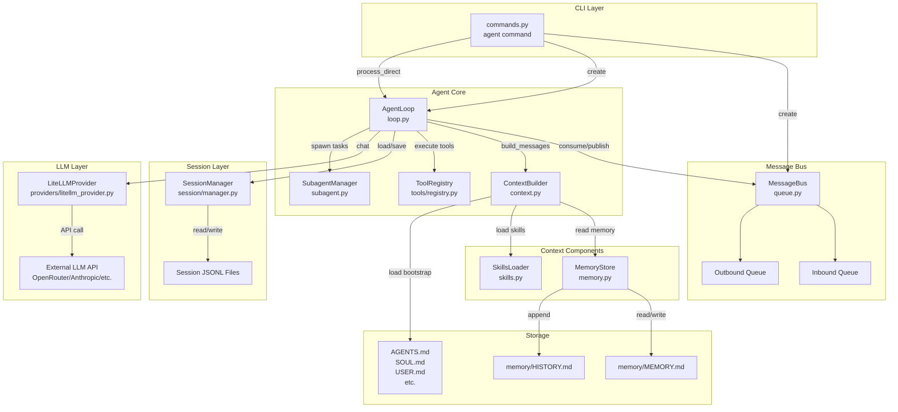
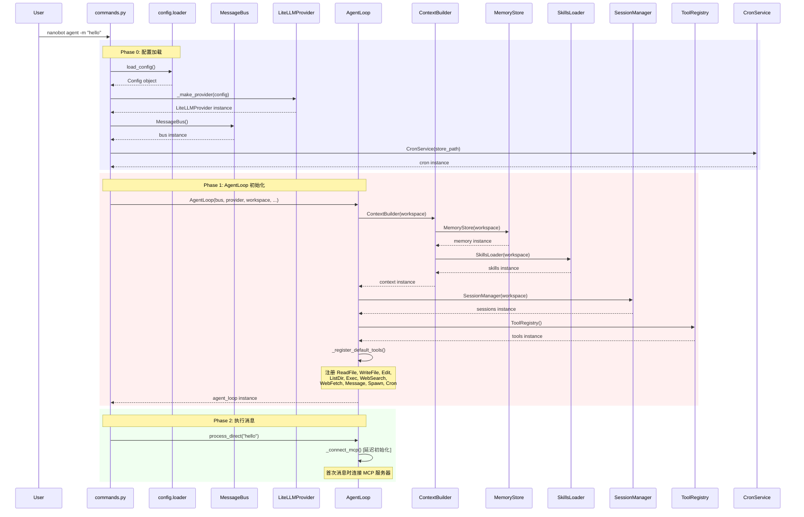
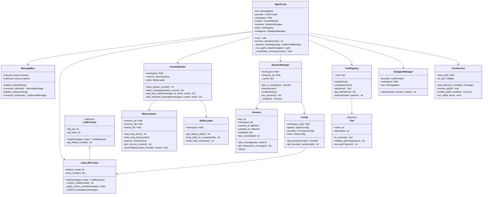

# Nanobot Agent 命令执行流程详解

本文档详细说明 `nanobot agent -m "hello"` 命令从输入到输出的完整执行流程，包括涉及的所有关键类、初始化时机、组件职责以及消息处理时序。

## 目录

- [概述](#概述)
- [系统架构图](#系统架构图)
- [初始化时序](#初始化时序)
- [消息处理流程](#消息处理流程)
- [类图与关系](#类图与关系)
- [关键类职责](#关键类职责)
- [核心流程深入解析](#核心流程深入解析)
  - [CLI 入口和参数解析](#cli-入口和参数解析)
  - [上下文构建详解](#上下文构建详解)
  - [LLM 调用流程](#llm-调用流程)
  - [工具系统](#工具系统)
  - [会话管理](#会话管理)
  - [记忆整合系统](#记忆整合系统)
- [特殊场景](#特殊场景)
- [代码示例](#代码示例)

---

## 概述

`nanobot agent -m "hello"` 是单消息直接调用模式，不同于交互模式，它：
- 直接调用 `AgentLoop.process_direct()` 而不经过 MessageBus
- 执行完成后立即退出，不保持长连接
- 主要用于 CLI 快速查询和 Cron Job 执行

**核心概念：**
- **MessageBus**: 异步消息队列，解耦 Channel 和 AgentLoop
- **AgentLoop**: 核心处理引擎，管理整个消息处理生命周期
- **ContextBuilder**: 提示词组装器，构建 System Prompt + History + Current Message
- **SessionManager**: 会话持久化管理器，JSONL 格式存储对话历史
- **MemoryStore**: 双层记忆系统（MEMORY.md + HISTORY.md）
- **ToolRegistry**: 工具注册和执行中心

---

## 系统架构图



---

## 初始化时序



**初始化关键点：**

1. **配置加载阶段** (`commands.py:449-456`)
   - 加载 `~/.nanobot/config.json`
   - 根据配置创建 LLM Provider
   - 创建 MessageBus 实例
   - 创建 CronService 实例

2. **AgentLoop 构造阶段** (`loop.py:46-122`)
   - 创建 ContextBuilder，内部自动创建 MemoryStore 和 SkillsLoader
   - 创建 SessionManager
   - 创建 ToolRegistry
   - 创建 SubagentManager
   - 调用 `_register_default_tools()` 注册默认工具

3. **延迟初始化阶段**
   - MCP 服务器连接在首次消息时触发 (`loop.py:140-160`)
   - Session 按需加载 (`manager.py:115-160`)

---

## 消息处理流程

```mermaid
flowchart TD
    START([用户输入: nanobot agent -m "hello"])

    START --> PARSE[CLI 参数解析<br/>commands.py:436-441]

    PARSE --> INIT_CHECK{message 参数<br/>是否存在?}

    INIT_CHECK -->|是| DIRECT[单消息模式<br/>process_direct]
    INIT_CHECK -->|否| INTERACTIVE[交互模式<br/>通过 MessageBus]

    DIRECT --> CONNECT_MCP[连接 MCP 服务器<br/>loop.py:479]

    CONNECT_MCP --> CREATE_MSG[创建 InboundMessage<br/>loop.py:480]

    CREATE_MSG --> PROCESS[_process_message<br/>loop.py:315-446]

    PROCESS --> GET_SESSION[获取/创建 Session<br/>loop.py:345]

    GET_SESSION --> LOAD_HISTORY[加载历史消息<br/>session.get_history<br/>loop.py:410]

    LOAD_HISTORY --> BUILD_CTX[构建上下文<br/>context.build_messages<br/>loop.py:411-416]

    BUILD_CTX --> BUILD_DETAIL[上下文构建细节]

    BUILD_DETAIL --> SYS_PROMPT[1. System Prompt<br/>- Identity<br/>- Bootstrap 文件<br/>- Memory<br/>- Skills]

    SYS_PROMPT --> HIST[2. 历史消息<br/>滑动窗口]

    HIST --> CURR[3. 当前消息<br/>+ Runtime Context]

    CURR --> RUN_LOOP[_run_agent_loop<br/>loop.py:193-257]

    RUN_LOOP --> ITER{迭代计数<br/>< max_iterations?}

    ITER -->|是| LLM_CALL[LLM 调用<br/>provider.chat<br/>loop.py:207-213]

    LLM_CALL --> HAS_TOOLS{响应包含<br/>tool_calls?}

    HAS_TOOLS -->|是| TOOL_EXEC[执行工具<br/>tools.execute<br/>loop.py:238-245]

    TOOL_EXEC --> ADD_RESULT[添加工具结果<br/>到消息列表<br/>loop.py:243-245]

    ADD_RESULT --> ITER

    HAS_TOOLS -->|否| FINAL[提取最终内容<br/>loop.py:247]

    ITER -->|否| MAX_ITER[达到最大迭代<br/>返回错误提示<br/>loop.py:250-255]

    MAX_ITER --> FINAL

    FINAL --> SAVE[保存会话<br/>_save_turn<br/>loop.py:436-437]

    SAVE --> CHECK_CONSOL{需要记忆<br/>整合?}

    CHECK_CONSOL -->|是| CONSOL_BG[后台异步整合<br/>loop.py:390-403]
    CHECK_CONSOL -->|否| RETURN

    CONSOL_BG --> RETURN[返回响应<br/>loop.py:443-446]

    RETURN --> RENDER[CLI 渲染输出<br/>commands.py:501]

    RENDER --> CLOSE[关闭 MCP 连接<br/>commands.py:502]

    CLOSE --> END([结束])

    style START fill:#e1f5e1
    style END fill:#ffe1e1
    style LLM_CALL fill:#e1e5ff
    style TOOL_EXEC fill:#fff5e1
    style CONSOL_BG fill:#f5e1ff
```

**流程关键点：**

1. **Session 获取** (`loop.py:345`): 根据 `session_key` 获取或创建 Session
2. **历史加载** (`loop.py:410`): 加载最近 `memory_window` 条消息
3. **上下文构建** (`loop.py:411-416`): 组装完整的 LLM 输入
4. **Agent 循环** (`loop.py:426-428`):
   - LLM 调用 → 工具执行 → 迭代
   - 直到没有 tool_calls 或达到 max_iterations
5. **会话保存** (`loop.py:436-437`): 将新消息追加到 Session
6. **记忆整合触发** (`loop.py:384-403`):
   - 条件: `未整合消息数 >= memory_window`
   - 方式: 后台异步执行，不阻塞响应

---

## 类图与关系



---

## 关键类职责

| 类名 | 文件位置 | 初始化时机 | 核心职责 |
|------|---------|-----------|---------|
| **Config** | `config/schema.py` | 命令启动时 | 全局配置管理，Provider 路由 |
| **MessageBus** | `bus/queue.py` | 命令启动时 | 异步消息队列，解耦 Channel 和 Agent |
| **LiteLLMProvider** | `providers/litellm_provider.py` | 配置加载后 | 多 Provider 统一接口，LLM API 调用 |
| **AgentLoop** | `agent/loop.py` | CLI 创建时 | 核心处理引擎，管理消息处理生命周期 |
| **ContextBuilder** | `agent/context.py` | AgentLoop.\_\_init\_\_ | 提示词组装，System Prompt + History + Current |
| **MemoryStore** | `agent/memory.py` | ContextBuilder.\_\_init\_\_ | 双层记忆管理（MEMORY.md + HISTORY.md） |
| **SkillsLoader** | `agent/skills.py` | ContextBuilder.\_\_init\_\_ | 技能加载，Progressive Loading 机制 |
| **SessionManager** | `session/manager.py` | AgentLoop.\_\_init\_\_ | 会话持久化，JSONL 格式存储 |
| **Session** | `session/manager.py` | 按需创建 | 单个会话容器，append-only 消息列表 |
| **ToolRegistry** | `agent/tools/registry.py` | AgentLoop.\_\_init\_\_ | 工具注册和执行，动态工具管理 |
| **SubagentManager** | `agent/subagent.py` | AgentLoop.\_\_init\_\_ | 子 Agent 并行任务管理 |
| **CronService** | `cron/service.py` | 命令启动时 | 定时任务调度服务 |

---

## 核心流程深入解析

### CLI 入口和参数解析

**入口点定义** (`pyproject.toml`):
```toml
[project.scripts]
nanobot = "nanobot.cli.commands:app"
```

**Typer 框架使用** (`commands.py:435-442`):
```python
@app.command()
def agent(
    message: str = typer.Option(None, "--message", "-m", help="Message to send to the agent"),
    session_id: str = typer.Option("cli:direct", "--session", "-s", help="Session ID"),
    markdown: bool = typer.Option(True, "--markdown/--no-markdown", help="Render assistant output as Markdown"),
    logs: bool = typer.Option(False, "--logs/--no-logs", help="Show nanobot runtime logs during chat"),
):
```

**单消息模式处理** (`commands.py:496-504`):
```python
if message:
    # Single message mode — direct call, no bus needed
    async def run_once():
        with _thinking_ctx():
            response = await agent_loop.process_direct(message, session_id, on_progress=_cli_progress)
        _print_agent_response(response, render_markdown=markdown)
        await agent_loop.close_mcp()

    asyncio.run(run_once())
```

---

### 上下文构建详解

**System Prompt 组成** (`context.py:30-73`):

1. **Identity 部分** (`context.py:76-106`):
   - Runtime 信息（OS、Python 版本）
   - Workspace 路径
   - 工具使用指南
   - 记忆系统说明

2. **Bootstrap 文件** (`context.py:125-135`):
   - `AGENTS.md`: Agent 身份定义
   - `SOUL.md`: 核心价值观
   - `USER.md`: 用户信息
   - `TOOLS.md`: 工具使用约定
   - `IDENTITY.md`: 自定义身份

3. **Memory Context** (`context.py:50-53`):
   - 从 `MEMORY.md` 加载长期记忆
   - 提供历史事实和知识背景

4. **Skills** (`context.py:55-71`):
   - **Always-loaded skills**: 完整内容嵌入 System Prompt
   - **Available skills**: 仅显示摘要，Agent 通过 `read_file` 按需加载

**历史消息滑动窗口** (`session.py:45-63`):
```python
def get_history(self, max_messages: int = 500) -> list[dict[str, Any]]:
    """Return unconsolidated messages for LLM input, aligned to a user turn."""
    unconsolidated = self.messages[self.last_consolidated:]
    sliced = unconsolidated[-max_messages:]

    # Drop leading non-user messages to avoid orphaned tool_result blocks
    for i, m in enumerate(sliced):
        if m.get("role") == "user":
            sliced = sliced[i:]
            break
```

**关键特性：**
- 只返回未整合的消息（`messages[last_consolidated:]`）
- 滑动窗口取最近 `max_messages` 条
- 从第一个 `user` 消息开始，避免孤立的 `tool` 消息

**Runtime Context 注入** (`context.py:109-123`):
```python
def _inject_runtime_context(user_content, channel, chat_id):
    now = datetime.now().strftime("%Y-%m-%d %H:%M (%A)")
    tz = time.strftime("%Z") or "UTC"
    lines = [f"Current Time: {now} ({tz})"]
    if channel and chat_id:
        lines += [f"Channel: {channel}", f"Chat ID: {chat_id}"]
    block = "[Runtime Context]\n" + "\n".join(lines)
    # ... append to user message
```

---

### LLM 调用流程

**Provider 选择逻辑** (`commands.py:232-267`):
```python
def _make_provider(config: Config):
    model = config.agents.defaults.model
    provider_name = config.get_provider_name(model)

    # OpenAI Codex (OAuth)
    if provider_name == "openai_codex" or model.startswith("openai-codex/"):
        return OpenAICodexProvider(default_model=model)

    # Custom: direct OpenAI-compatible endpoint
    if provider_name == "custom":
        return CustomProvider(...)

    # LiteLLM: unified multi-provider support
    return LiteLLMProvider(...)
```

**消息清理和格式化** (`litellm_provider.py:156-165`):
```python
def _sanitize_messages(messages: list[dict[str, Any]]) -> list[dict[str, Any]]:
    """Strip non-standard keys and ensure assistant messages have a content key."""
    sanitized = []
    for msg in messages:
        clean = {k: v for k, v in msg.items() if k in _ALLOWED_MSG_KEYS}
        # Strict providers require "content" even when assistant only has tool_calls
        if clean.get("role") == "assistant" and "content" not in clean:
            clean["content"] = None
        sanitized.append(clean)
    return sanitized
```

**允许的消息键**:
```python
_ALLOWED_MSG_KEYS = frozenset({
    "role", "content", "tool_calls", "tool_call_id", "name", "reasoning_content"
})
```

**Cache Control 注入** (`litellm_provider.py:119-143`):

Anthropic Claude 支持 Prompt Caching，将 System Prompt 和 Tools 标记为 `cache_control`：

```python
def _apply_cache_control(messages, tools):
    new_messages = []
    for msg in messages:
        if msg.get("role") == "system":
            content = msg["content"]
            if isinstance(content, str):
                new_content = [{"type": "text", "text": content, "cache_control": {"type": "ephemeral"}}]
            else:
                new_content = list(content)
                new_content[-1] = {**new_content[-1], "cache_control": {"type": "ephemeral"}}
            new_messages.append({**msg, "content": new_content})
        else:
            new_messages.append(msg)

    new_tools = tools
    if tools:
        new_tools = list(tools)
        new_tools[-1] = {**new_tools[-1], "cache_control": {"type": "ephemeral"}}

    return new_messages, new_tools
```

**响应解析** (`litellm_provider.py:234-269`):
```python
def _parse_response(response) -> LLMResponse:
    choice = response.choices[0]
    message = choice.message

    tool_calls = []
    if hasattr(message, "tool_calls") and message.tool_calls:
        for tc in message.tool_calls:
            args = tc.function.arguments
            if isinstance(args, str):
                args = json_repair.loads(args)  # 修复畸形 JSON

            tool_calls.append(ToolCallRequest(
                id=tc.id,
                name=tc.function.name,
                arguments=args,
            ))

    reasoning_content = getattr(message, "reasoning_content", None) or None

    return LLMResponse(
        content=message.content,
        tool_calls=tool_calls,
        finish_reason=choice.finish_reason or "stop",
        usage={...},
        reasoning_content=reasoning_content,
    )
```

---

### 工具系统

**工具注册机制** (`loop.py:123-138`):
```python
def _register_default_tools(self) -> None:
    allowed_dir = self.workspace if self.restrict_to_workspace else None

    # File operations
    for cls in (ReadFileTool, WriteFileTool, EditFileTool, ListDirTool):
        self.tools.register(cls(workspace=self.workspace, allowed_dir=allowed_dir))

    # Shell execution
    self.tools.register(ExecTool(
        working_dir=str(self.workspace),
        timeout=self.exec_config.timeout,
        restrict_to_workspace=self.restrict_to_workspace,
    ))

    # Web tools
    self.tools.register(WebSearchTool(api_key=self.brave_api_key))
    self.tools.register(WebFetchTool())

    # Communication and orchestration
    self.tools.register(MessageTool(send_callback=self.bus.publish_outbound))
    self.tools.register(SpawnTool(manager=self.subagents))

    # Cron management
    if self.cron_service:
        self.tools.register(CronTool(self.cron_service))
```

**工具执行流程** (`registry.py:38-55`):
```python
async def execute(self, name: str, params: dict[str, Any]) -> str:
    _HINT = "\n\n[Analyze the error above and try a different approach.]"

    tool = self._tools.get(name)
    if not tool:
        return f"Error: Tool '{name}' not found. Available: {', '.join(self.tool_names)}"

    try:
        errors = tool.validate_params(params)
        if errors:
            return f"Error: Invalid parameters for tool '{name}': " + "; ".join(errors) + _HINT
        result = await tool.execute(**params)
        if isinstance(result, str) and result.startswith("Error"):
            return result + _HINT
        return result
    except Exception as e:
        return f"Error executing {name}: {str(e)}" + _HINT
```

**工具调用循环** (`loop.py:193-257`):
```python
async def _run_agent_loop(initial_messages, on_progress):
    messages = initial_messages
    iteration = 0
    final_content = None
    tools_used: list[str] = []

    while iteration < self.max_iterations:
        iteration += 1

        response = await self.provider.chat(
            messages=messages,
            tools=self.tools.get_definitions(),
            model=self.model,
            temperature=self.temperature,
            max_tokens=self.max_tokens,
        )

        if response.has_tool_calls:
            # 执行工具
            for tool_call in response.tool_calls:
                tools_used.append(tool_call.name)
                result = await self.tools.execute(tool_call.name, tool_call.arguments)
                messages = self.context.add_tool_result(
                    messages, tool_call.id, tool_call.name, result
                )
        else:
            final_content = self._strip_think(response.content)
            break

    return final_content, tools_used, messages
```

**默认工具列表**:
- `read_file`: 读取文件内容
- `write_file`: 写入文件
- `edit_file`: 编辑文件
- `list_dir`: 列出目录
- `exec`: 执行 Shell 命令
- `web_search`: Brave 搜索
- `web_fetch`: 抓取网页
- `message`: 发送消息到频道
- `spawn`: 创建子 Agent
- `cron`: 管理定时任务

---

### 会话管理

**Session 的 JSONL 格式** (`manager.py:162-178`):

```jsonl
{"_type": "metadata", "key": "cli:direct", "created_at": "2026-03-19T15:00:00", "updated_at": "2026-03-19T15:05:00", "metadata": {}, "last_consolidated": 5}
{"role": "user", "content": "hello", "timestamp": "2026-03-19T15:00:01"}
{"role": "assistant", "content": "Hi! How can I help you today?", "timestamp": "2026-03-19T15:00:02"}
{"role": "user", "content": "what's the weather?", "timestamp": "2026-03-19T15:02:00"}
{"role": "assistant", "content": null, "tool_calls": [...], "timestamp": "2026-03-19T15:02:01"}
{"role": "tool", "tool_call_id": "call_123", "name": "web_search", "content": "...", "timestamp": "2026-03-19T15:02:02"}
{"role": "assistant", "content": "The weather is...", "timestamp": "2026-03-19T15:02:03"}
```

**第一行是元数据**:
- `_type`: `"metadata"` 标识
- `last_consolidated`: 已整合的消息数量
- 其余行是消息列表

**会话加载和缓存** (`manager.py:115-160`):
```python
def _load(self, key: str) -> Session | None:
    path = self._get_session_path(key)
    if not path.exists():
        # 尝试从旧路径迁移
        legacy_path = self._get_legacy_session_path(key)
        if legacy_path.exists():
            shutil.move(str(legacy_path), str(path))

    messages = []
    metadata = {}
    created_at = None
    last_consolidated = 0

    with open(path, encoding="utf-8") as f:
        for line in f:
            data = json.loads(line.strip())
            if data.get("_type") == "metadata":
                metadata = data.get("metadata", {})
                created_at = datetime.fromisoformat(data["created_at"])
                last_consolidated = data.get("last_consolidated", 0)
            else:
                messages.append(data)

    return Session(
        key=key,
        messages=messages,
        created_at=created_at or datetime.now(),
        metadata=metadata,
        last_consolidated=last_consolidated
    )
```

**会话保存时机** (`loop.py:436-437`):
```python
self._save_turn(session, all_msgs, 1 + len(history))
self.sessions.save(session)
```

每次对话结束后立即保存。

**last_consolidated 字段的作用** (`session.py:32`):

```python
last_consolidated: int = 0  # Number of messages already consolidated to files
```

- 记录已经整合到 `MEMORY.md` / `HISTORY.md` 的消息数量
- `get_history()` 只返回 `messages[last_consolidated:]` 未整合部分
- 整合完成后更新此字段，避免重复整合

---

### 记忆整合系统

**触发条件** (`loop.py:384-403`):
```python
unconsolidated = len(session.messages) - session.last_consolidated

if (unconsolidated >= self.memory_window and session.key not in self._consolidating):
    self._consolidating.add(session.key)
    lock = self._get_consolidation_lock(session.key)

    async def _consolidate_and_unlock():
        try:
            async with lock:
                await self._consolidate_memory(session)
        finally:
            self._consolidating.discard(session.key)
            self._prune_consolidation_lock(session.key, lock)
            _task = asyncio.current_task()
            if _task is not None:
                self._consolidation_tasks.discard(_task)

    _task = asyncio.create_task(_consolidate_and_unlock())
    self._consolidation_tasks.add(_task)
```

**触发条件**:
- 未整合消息数 >= `memory_window` (默认 100)
- 该 Session 当前没有整合任务在运行

**整合流程** (`memory.py:69-150`):

1. **提取待整合消息**:
   ```python
   keep_count = memory_window // 2
   old_messages = session.messages[session.last_consolidated:-keep_count]
   ```

2. **调用 LLM 整合**:
   ```python
   response = await provider.chat(
       messages=[
           {"role": "system", "content": "You are a memory consolidation agent..."},
           {"role": "user", "content": prompt},
       ],
       tools=_SAVE_MEMORY_TOOL,
       model=model,
   )
   ```

3. **保存整合结果**:
   ```python
   if entry := args.get("history_entry"):
       self.append_history(entry)  # → HISTORY.md
   if update := args.get("memory_update"):
       self.write_long_term(update)  # → MEMORY.md
   ```

4. **更新 last_consolidated**:
   ```python
   session.last_consolidated = len(session.messages) - keep_count
   ```

**MEMORY.md vs HISTORY.md**:

| 文件 | 内容 | 格式 | 更新方式 |
|------|------|------|---------|
| **MEMORY.md** | 长期事实和知识 | Markdown | 覆盖写入 |
| **HISTORY.md** | 时间线日志 | 时间戳 + 段落 | 追加写入 |

**后台异步执行**:
- 整合任务不阻塞响应返回
- 使用 `asyncio.Lock` 防止并发整合冲突
- 任务引用保存在 `_consolidation_tasks` 防止 GC 回收

---

## 特殊场景

### 单消息模式 (`-m` 参数)

**与交互模式的区别**:

| 特性 | 单消息模式 (`-m`) | 交互模式 |
|------|------------------|---------|
| 入口 | `process_direct()` | MessageBus |
| 生命周期 | 一次性执行，立即退出 | 持续运行，监听队列 |
| 用途 | CLI 快速查询，Cron Job | 长连接聊天（Telegram、Slack 等） |
| MCP 连接 | 首次消息时连接 | `run()` 启动时连接 |

**process_direct() 的调用** (`commands.py:496-504`):
```python
if message:
    async def run_once():
        with _thinking_ctx():
            response = await agent_loop.process_direct(message, session_id, on_progress=_cli_progress)
        _print_agent_response(response, render_markdown=markdown)
        await agent_loop.close_mcp()

    asyncio.run(run_once())
```

**process_direct() 实现** (`loop.py:470-482`):
```python
async def process_direct(
    self,
    content: str,
    session_key: str = "cli:direct",
    channel: str = "cli",
    chat_id: str = "direct",
    on_progress: Callable[[str], Awaitable[None]] | None = None,
) -> str:
    """Process a message directly (for CLI or cron usage)."""
    await self._connect_mcp()
    msg = InboundMessage(channel=channel, sender_id="user", chat_id=chat_id, content=content)
    response = await self._process_message(msg, session_key=session_key, on_progress=on_progress)
    return response.content if response else ""
```

---

### MCP 服务器连接

**延迟初始化机制** (`loop.py:140-160`):
```python
async def _connect_mcp(self) -> None:
    """Connect to configured MCP servers (one-time, lazy)."""
    if self._mcp_connected or self._mcp_connecting or not self._mcp_servers:
        return
    self._mcp_connecting = True
    from nanobot.agent.tools.mcp import connect_mcp_servers
    try:
        self._mcp_stack = AsyncExitStack()
        await self._mcp_stack.__aenter__()
        await connect_mcp_servers(self._mcp_servers, self.tools, self._mcp_stack)
        self._mcp_connected = True
    except Exception as e:
        logger.error("Failed to connect MCP servers (will retry next message): {}", e)
        if self._mcp_stack:
            try:
                await self._mcp_stack.aclose()
            except Exception:
                pass
            self._mcp_stack = None
    finally:
        self._mcp_connecting = False
```

**连接时机**:
- **交互模式**: `run()` 启动时调用 (`loop.py:262`)
- **单消息模式**: `process_direct()` 首次调用时 (`loop.py:479`)

**连接失败处理**:
- 错误日志记录，不阻塞 Agent 启动
- 下次消息会重试连接
- MCP 工具不可用，其他工具正常

**工具动态注册**:
MCP 工具在连接成功后动态注入 `ToolRegistry`

---

### `/new` 命令

**执行流程** (`loop.py:349-379`):

```python
if cmd == "/new":
    # 1. 获取整合锁，防止并发
    lock = self._get_consolidation_lock(session.key)
    self._consolidating.add(session.key)

    try:
        async with lock:
            # 2. 提取未整合消息
            snapshot = session.messages[session.last_consolidated:]
            if snapshot:
                # 3. 创建临时 Session
                temp = Session(key=session.key)
                temp.messages = list(snapshot)

                # 4. 整合到 MEMORY.md / HISTORY.md
                if not await self._consolidate_memory(temp, archive_all=True):
                    return OutboundMessage(
                        channel=msg.channel, chat_id=msg.chat_id,
                        content="Memory archival failed, session not cleared. Please try again.",
                    )
    finally:
        self._consolidating.discard(session.key)
        self._prune_consolidation_lock(session.key, lock)

    # 5. 清空会话
    session.clear()
    self.sessions.save(session)
    self.sessions.invalidate(session.key)

    return OutboundMessage(channel=msg.channel, chat_id=msg.chat_id,
                          content="New session started.")
```

**关键步骤**:
1. 获取整合锁，防止并发整合冲突
2. 提取 `messages[last_consolidated:]` 未整合部分
3. 创建临时 Session 用于整合
4. 调用 `_consolidate_memory(archive_all=True)` 全量整合
5. 清空 `session.messages` 和 `last_consolidated`
6. 保存并使缓存失效

**与普通整合的区别**:
- `archive_all=True`: 整合所有未整合消息，不保留滑动窗口
- 整合后清空 Session，重新开始

---

## 代码示例

### 完整的 `-m` 模式执行示例

```python
# commands.py:496-504
if message:
    async def run_once():
        with _thinking_ctx():
            response = await agent_loop.process_direct(
                message,
                session_id,
                on_progress=_cli_progress
            )
        _print_agent_response(response, render_markdown=markdown)
        await agent_loop.close_mcp()

    asyncio.run(run_once())
```

### 上下文构建示例

```python
# context.py:137-174
def build_messages(self, history, current_message, skill_names=None, media=None, channel=None, chat_id=None):
    messages = []

    # 1. System prompt
    system_prompt = self.build_system_prompt(skill_names)
    messages.append({"role": "system", "content": system_prompt})

    # 2. History
    messages.extend(history)

    # 3. Current message (with optional image attachments)
    user_content = self._build_user_content(current_message, media)
    user_content = self._inject_runtime_context(user_content, channel, chat_id)
    messages.append({"role": "user", "content": user_content})

    return messages
```

### Agent 循环示例

```python
# loop.py:193-257
async def _run_agent_loop(self, initial_messages, on_progress=None):
    messages = initial_messages
    iteration = 0
    final_content = None
    tools_used: list[str] = []

    while iteration < self.max_iterations:
        iteration += 1

        # LLM 调用
        response = await self.provider.chat(
            messages=messages,
            tools=self.tools.get_definitions(),
            model=self.model,
            temperature=self.temperature,
            max_tokens=self.max_tokens,
        )

        if response.has_tool_calls:
            # 执行工具
            for tool_call in response.tool_calls:
                tools_used.append(tool_call.name)
                result = await self.tools.execute(tool_call.name, tool_call.arguments)
                messages = self.context.add_tool_result(
                    messages, tool_call.id, tool_call.name, result
                )
        else:
            # 没有工具调用，提取最终响应
            final_content = self._strip_think(response.content)
            break

    if final_content is None and iteration >= self.max_iterations:
        final_content = f"I reached the maximum number of tool call iterations ({self.max_iterations})..."

    return final_content, tools_used, messages
```

### 记忆整合示例

```python
# memory.py:69-150
async def consolidate(self, session, provider, model, *, archive_all=False, memory_window=50):
    # 1. 确定整合范围
    if archive_all:
        old_messages = session.messages
        keep_count = 0
    else:
        keep_count = memory_window // 2
        old_messages = session.messages[session.last_consolidated:-keep_count]

    # 2. 格式化消息
    lines = []
    for m in old_messages:
        if not m.get("content"):
            continue
        tools = f" [tools: {', '.join(m['tools_used'])}]" if m.get("tools_used") else ""
        lines.append(f"[{m.get('timestamp', '?')[:16]}] {m['role'].upper()}{tools}: {m['content']}")

    # 3. 调用 LLM
    current_memory = self.read_long_term()
    prompt = f"""Process this conversation and call the save_memory tool with your consolidation.

## Current Long-term Memory
{current_memory or "(empty)"}

## Conversation to Process
{chr(10).join(lines)}"""

    response = await provider.chat(
        messages=[
            {"role": "system", "content": "You are a memory consolidation agent..."},
            {"role": "user", "content": prompt},
        ],
        tools=_SAVE_MEMORY_TOOL,
        model=model,
    )

    # 4. 保存结果
    if response.has_tool_calls:
        args = response.tool_calls[0].arguments
        if entry := args.get("history_entry"):
            self.append_history(entry)  # HISTORY.md
        if update := args.get("memory_update"):
            self.write_long_term(update)  # MEMORY.md

        # 5. 更新 last_consolidated
        session.last_consolidated = 0 if archive_all else len(session.messages) - keep_count
        return True

    return False
```

---

## 总结

`nanobot agent -m "hello"` 命令的执行涉及多个精心设计的组件协同工作：

1. **配置加载** → **Provider 创建** → **AgentLoop 初始化**
2. **Session 加载** → **上下文构建** → **LLM 调用循环**
3. **工具执行** → **会话保存** → **记忆整合（后台）**

核心设计特点：
- **解耦架构**: MessageBus 解耦 Channel 和 Agent
- **延迟初始化**: MCP 服务器、Session 按需加载
- **滑动窗口**: 控制上下文长度，保持性能
- **双层记忆**: MEMORY.md（事实） + HISTORY.md（时间线）
- **异步整合**: 记忆整合不阻塞响应
- **Append-only**: Session 消息列表只增不减，LLM Cache 友好

理解这套流程后，可以：
- 自定义 Bootstrap 文件调整 Agent 行为
- 编写自定义 Tool 扩展功能
- 优化 Memory Window 和整合策略
- 调试会话持久化和记忆整合问题
