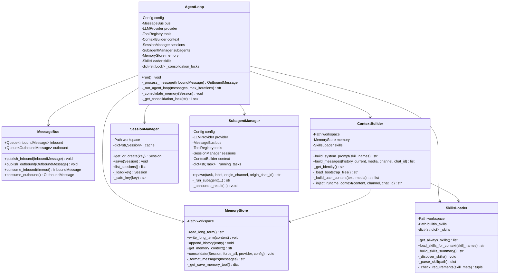
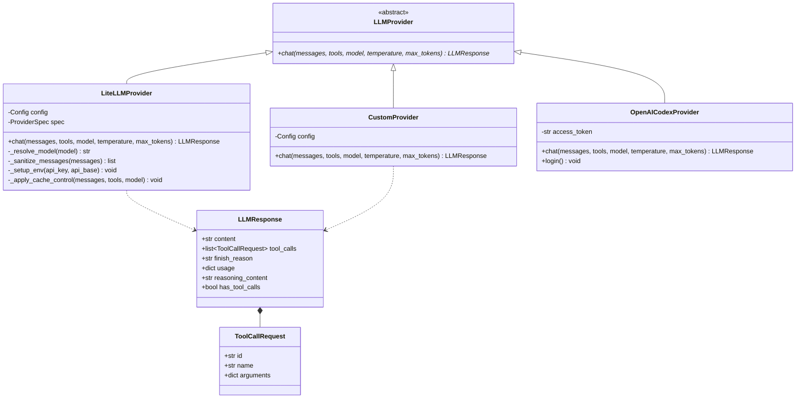
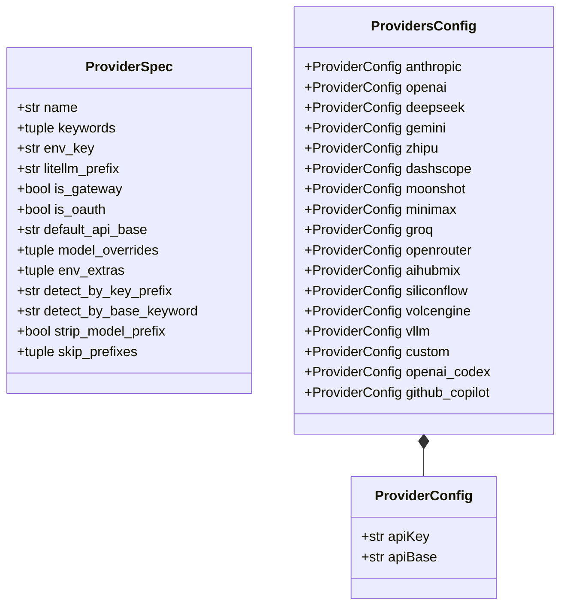
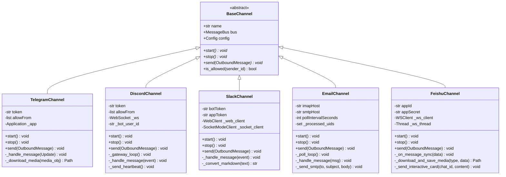
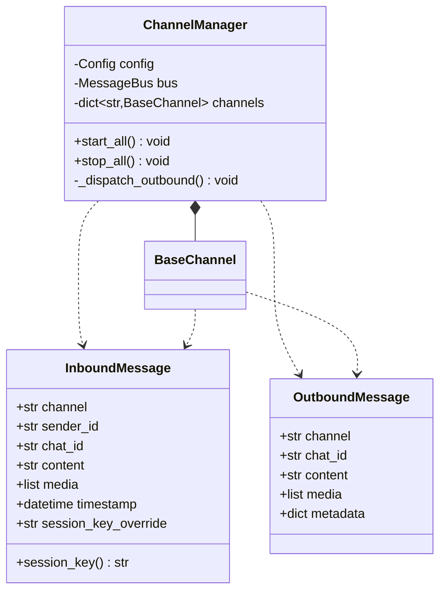
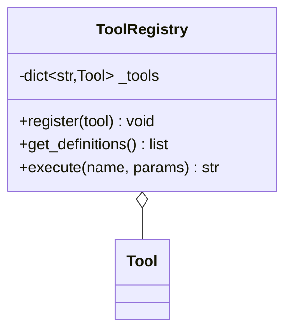
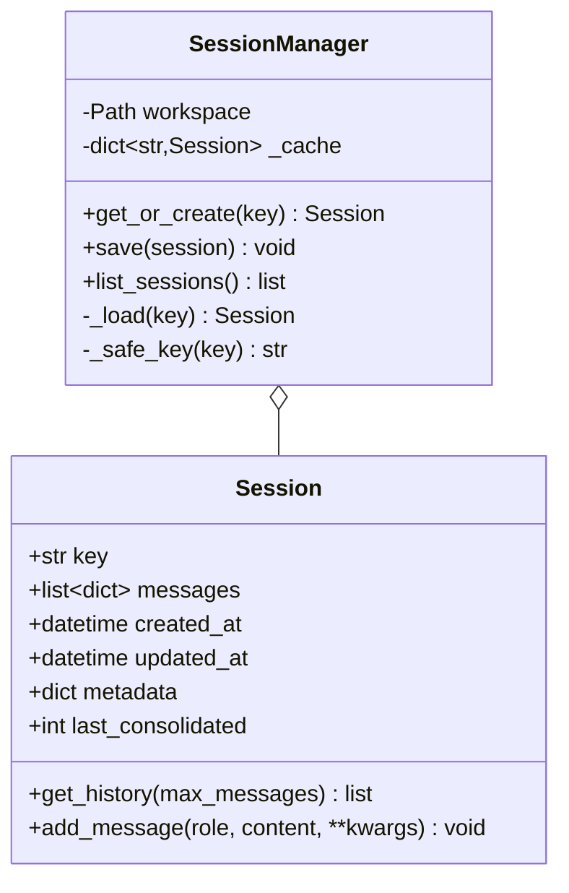
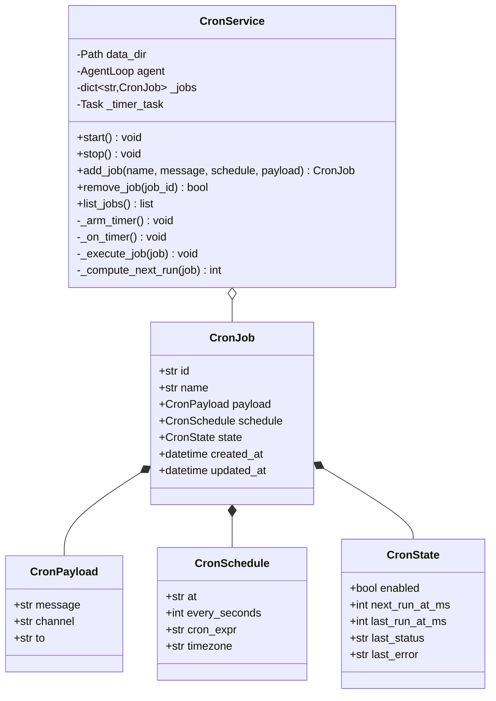
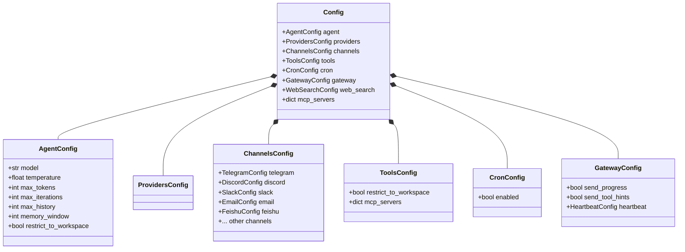
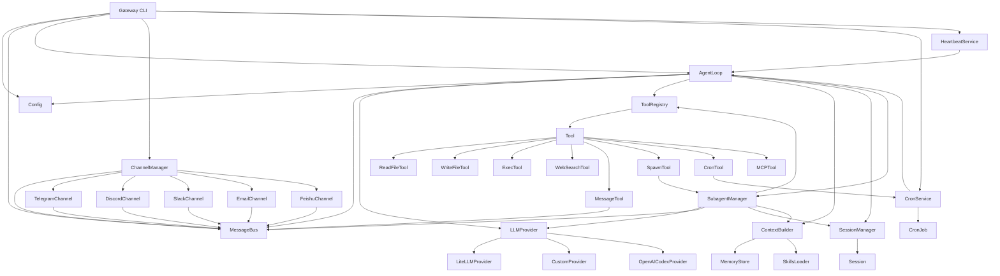

# 类图参考

本文档使用 Mermaid 类图展示 nanobot 的核心类结构和依赖关系。

## 核心类层次结构

### AgentLoop & 依赖组件



## Provider 系统

### LLMProvider 抽象层



### ProviderSpec 注册表



## Channel 系统

### BaseChannel 抽象层



### ChannelManager



## 工具系统

### Tool 抽象层

```mermaid
classDiagram
    class Tool {
        <<abstract>>
        +str name*
        +str description*
        +get_definition()* dict
        +validate_params(params) list|None
        +execute(**kwargs)* str
    }

    class ReadFileTool {
        -Path workspace
        +name = "read_file"
        +description = "Read a file from disk"
        +get_definition() dict
        +execute(file_path) str
    }

    class WriteFileTool {
        -Path workspace
        +name = "write_file"
        +description = "Write content to a file"
        +get_definition() dict
        +execute(file_path, content) str
    }

    class EditFileTool {
        -Path workspace
        +name = "edit_file"
        +description = "Edit lines in a file"
        +get_definition() dict
        +execute(file_path, old_text, new_text) str
    }

    class ExecTool {
        -Path workspace
        -bool restrict_to_workspace
        +name = "exec"
        +description = "Execute shell command"
        +get_definition() dict
        +execute(command) str
    }

    class WebSearchTool {
        -str brave_api_key
        +name = "web_search"
        +description = "Search the web"
        +get_definition() dict
        +execute(query) str
    }

    class MessageTool {
        -MessageBus bus
        -bool _sent_in_turn
        +name = "message"
        +description = "Send a message"
        +get_definition() dict
        +execute(content, channel, chat_id, media) str
    }

    class SpawnTool {
        -SubagentManager subagents
        +name = "spawn"
        +description = "Create a subagent"
        +get_definition() dict
        +execute(task, label) str
    }

    class CronTool {
        -CronService cron
        +name = "cron"
        +description = "Manage scheduled tasks"
        +get_definition() dict
        +execute(action, **kwargs) str
    }

    class MCPTool {
        -MCPClient client
        -dict tool_def
        +name = "{mcp_tool_name}"
        +description = "{from tool_def}"
        +get_definition() dict
        +execute(**kwargs) str
    }

    Tool <|-- ReadFileTool
    Tool <|-- WriteFileTool
    Tool <|-- EditFileTool
    Tool <|-- ExecTool
    Tool <|-- WebSearchTool
    Tool <|-- MessageTool
    Tool <|-- SpawnTool
    Tool <|-- CronTool
    Tool <|-- MCPTool
```

### ToolRegistry



## Session 系统



## Cron 系统



## 配置系统



## 完整依赖关系图



## 类关系说明

### 继承关系 (Inheritance)

- **LLMProvider** ← LiteLLMProvider, CustomProvider, OpenAICodexProvider
- **BaseChannel** ← TelegramChannel, DiscordChannel, SlackChannel, EmailChannel, FeishuChannel
- **Tool** ← ReadFileTool, WriteFileTool, ExecTool, WebSearchTool, MessageTool, SpawnTool, CronTool, MCPTool

### 组合关系 (Composition)

- **AgentLoop** ◆ MessageBus, ContextBuilder, SessionManager, MemoryStore, SkillsLoader, SubagentManager
- **ContextBuilder** ◆ MemoryStore, SkillsLoader
- **ChannelManager** ◆ BaseChannel (多个)
- **ToolRegistry** ◆ Tool (多个)
- **CronJob** ◆ CronPayload, CronSchedule, CronState

### 聚合关系 (Aggregation)

- **SessionManager** ○ Session (多个)
- **CronService** ○ CronJob (多个)

### 依赖关系 (Dependency)

- **AgentLoop** → LLMProvider, ToolRegistry
- **SubagentManager** → LLMProvider, ToolRegistry, MessageBus
- **Channels** → MessageBus
- **Tools** → MessageBus, SubagentManager, CronService

## 使用这些类图

所有类图使用 Mermaid 语法,可以在以下环境中渲染:

1. **GitHub**: 自动渲染
2. **VS Code**: 安装 Mermaid Preview 插件
3. **在线工具**: https://mermaid.live
4. **文档生成**: MkDocs + mermaid2 插件

## 下一步

- 查看 [数据流图](./data-flow-diagrams.md) 了解运行时流程
- 阅读 [文件索引](./file-index.md) 定位具体代码
- 参考 [架构概览](../00-overview.md) 理解设计理念
