# 数据流可视化图表

本文档使用 Mermaid 图表可视化 nanobot 的数据流动。

## 完整消息流转路径

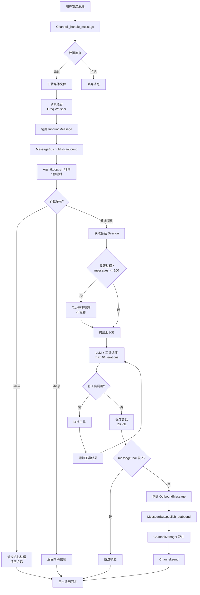

## AgentLoop 核心流程

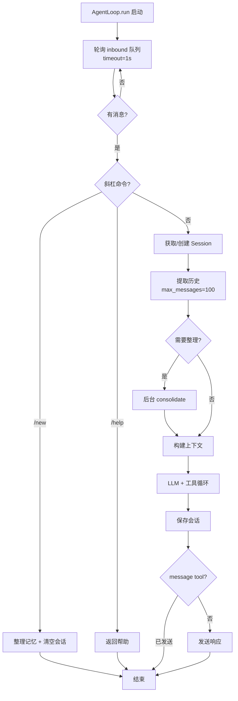

## LLM 工具执行循环

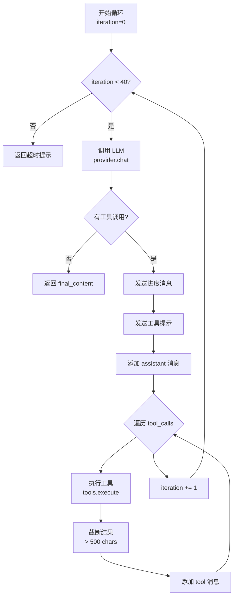

## Provider 路由逻辑

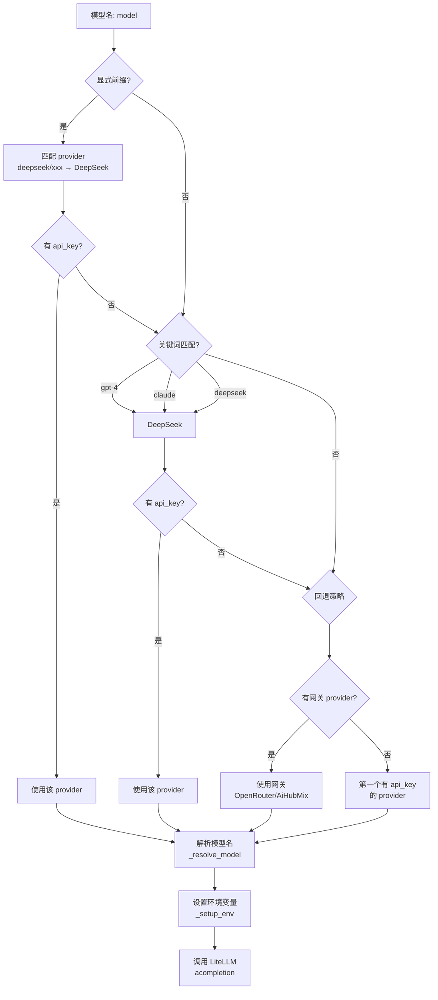

## Memory Consolidation 流程

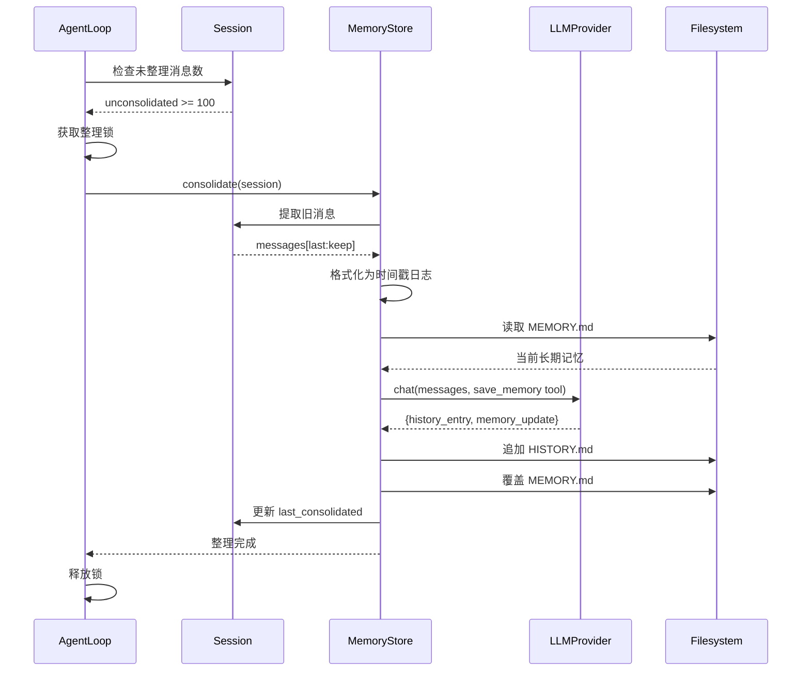

## Subagent 执行流程

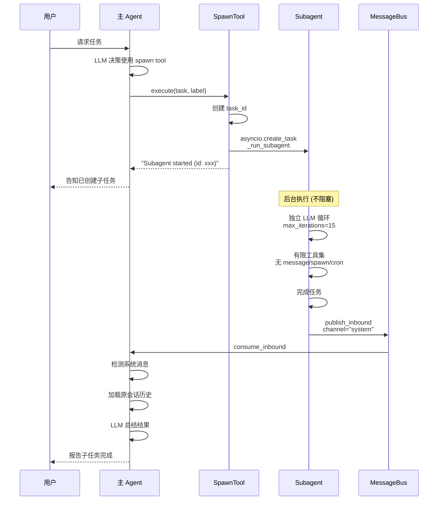

## Cron 调度流程

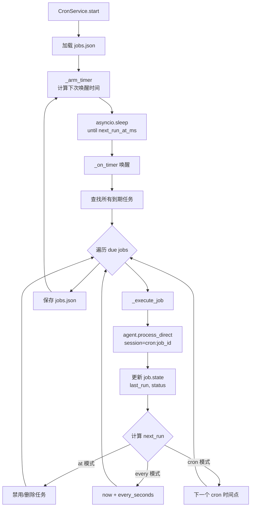

## Channel 消息处理 (以 Telegram 为例)

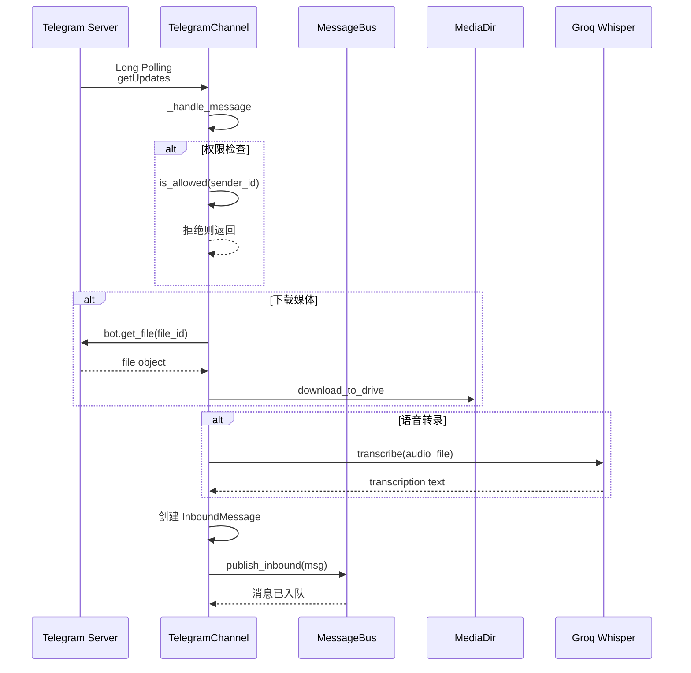

## Session 持久化

```mermaid
flowchart TD
    Start[session.messages.extend] --> Update[session.updated_at = now]
    Update --> Save[sessions.save<br/>session]

    Save --> Cache[更新内存缓存<br/>_cache[key] = session]
    Cache --> Path[生成文件路径<br/>{safe_key}.jsonl]

    Path --> Open[打开文件<br/>覆盖写入]
    Open --> Meta[写入 metadata 行<br/>_type=metadata]
    Meta --> Loop{遍历 messages}

    Loop --> WriteMsg[写入消息行<br/>JSON + \n]
    WriteMsg --> Loop

    Loop --> Close[关闭文件]
    Close --> End[保存完成]
```

## Context 构建流程

```mermaid
flowchart LR
    Start[开始构建] --> System[System Prompt]

    System --> Identity[1. Identity<br/>OS/Python/Workspace]
    Identity --> Bootstrap[2. Bootstrap Files<br/>AGENTS/SOUL/USER...]
    Bootstrap --> Memory[3. MEMORY.md<br/>长期事实]
    Memory --> AlwaysSkills[4. Always Skills<br/>完整内容]
    AlwaysSkills --> SkillsXML[5. Skills Summary<br/>XML 索引]

    SkillsXML --> History[6. Conversation History<br/>最近 100 条]
    History --> Current[7. Current Message<br/>文本 + base64 图片]

    Current --> Runtime[8. Runtime Context<br/>时间/Channel/ChatID]
    Runtime --> Messages[完整 messages 列表]
```

## 工具执行流程

```mermaid
sequenceDiagram
    participant LLM as LLM Response
    participant Loop as AgentLoop
    participant Registry as ToolRegistry
    participant Tool as Specific Tool

    LLM->>Loop: tool_calls: [{name, args}]
    Loop->>Registry: execute(name, args)

    Registry->>Registry: 查找 tool<br/>_tools.get(name)
    Registry->>Tool: validate_params(args)<br/>JSON Schema
    Tool-->>Registry: errors or None

    alt 参数错误
        Registry-->>Loop: "Parameter errors: ..."
    else 参数正确
        Registry->>Tool: execute(**args)
        Tool->>Tool: 执行工具逻辑
        Tool-->>Registry: result
        Registry-->>Loop: result
    end

    Loop->>Loop: 截断结果 (> 500 chars)
    Loop->>Loop: 添加 tool 消息到 history
```

## 组件依赖关系图

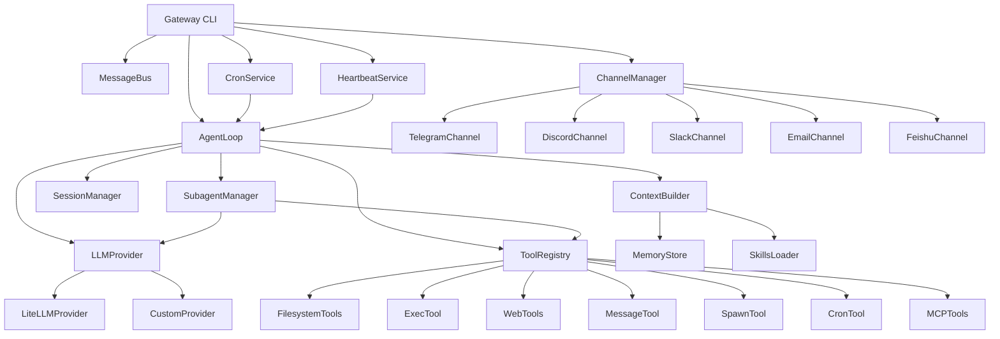

## Skills 加载策略

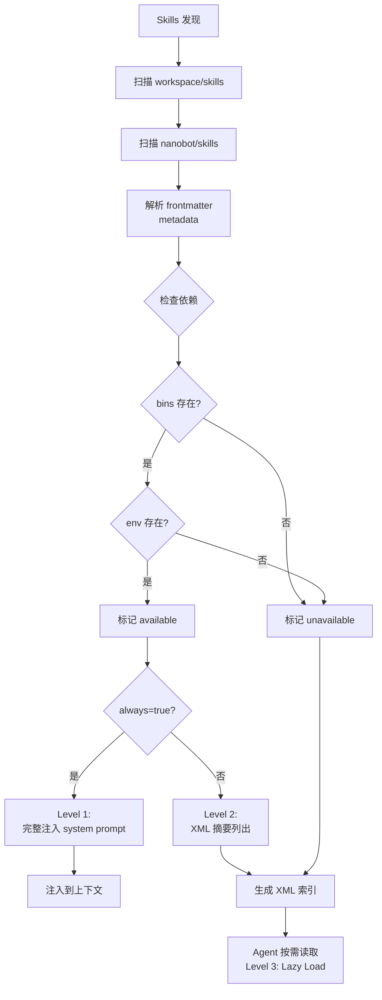

## Heartbeat 两阶段模型

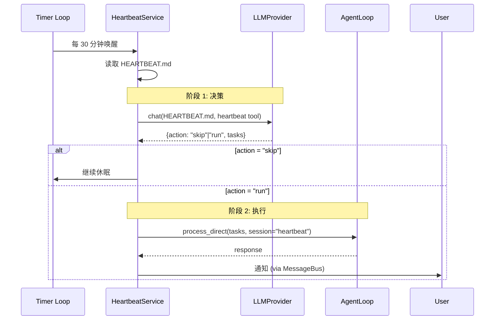

## 使用这些图表

所有图表使用 Mermaid 语法,可以在以下环境中渲染:

1. **GitHub**: 自动渲染
2. **VS Code**: 安装 Mermaid Preview 插件
3. **在线工具**: https://mermaid.live
4. **文档生成**: MkDocs + mermaid2 插件

## 下一步

- 查看 [文件索引](./file-index.md) 定位具体代码
- 阅读 [类图参考](./class-diagrams.md) 了解类结构
- 参考 [扩展开发指南](../04-extension-guide/) 开发新功能
